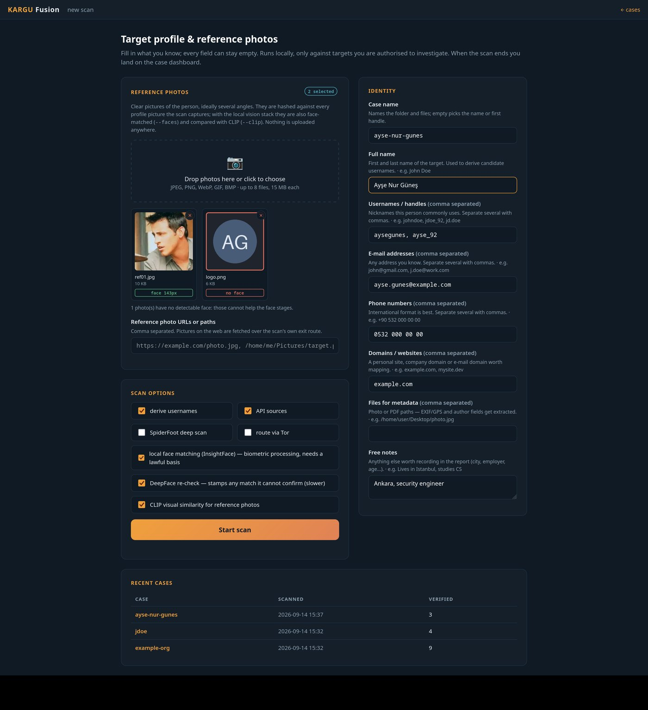
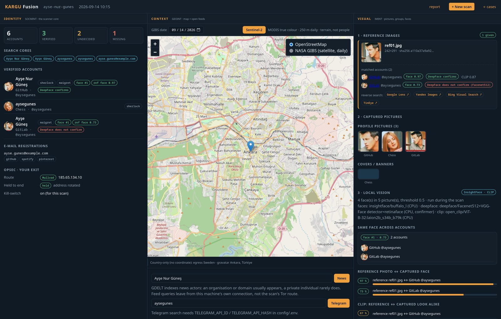
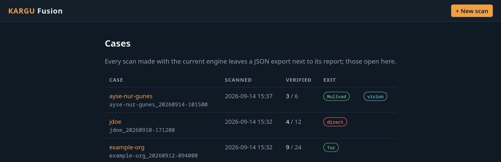
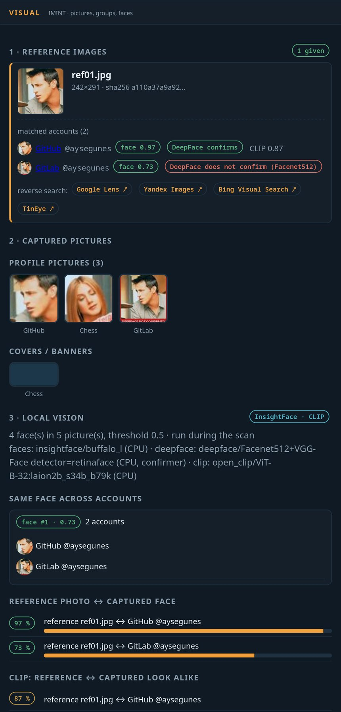
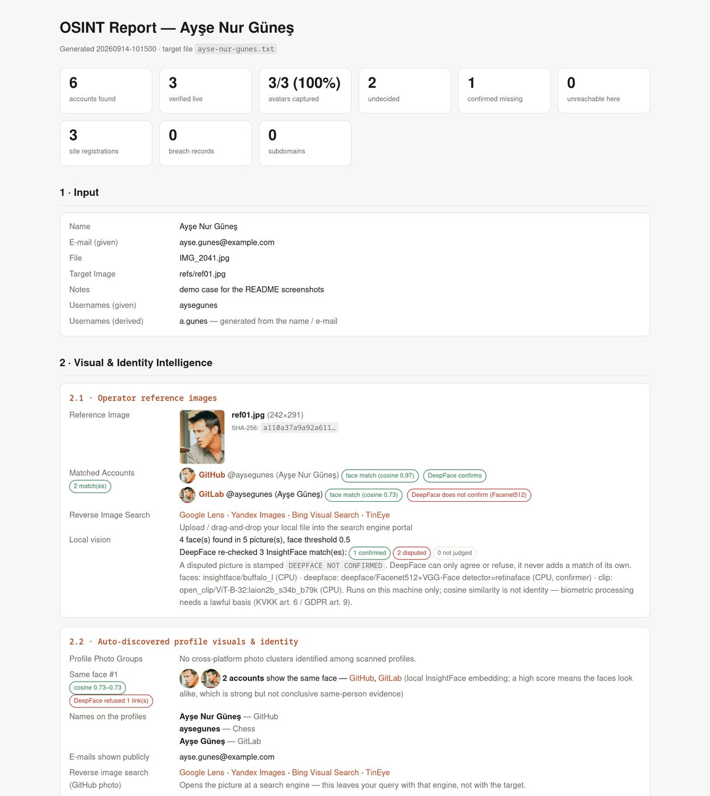

# KARGU-OSINT

**KARGU: Skeptical OSINT & Identity Verification Orchestrator.** Named after the *kargu* — the watchtowers of the old Turkic frontier that kept watch, gave early warning and passed word by fire — this tool sweeps, verifies and sieves a person's digital footprint without leaking the operator's own.

Person-focused OSINT automation: one target file in, one verified HTML report out — with the false-positive control, OPSEC accounting and exit-path checks that raw account-discovery tools lack.

Tool output and the interface are in **English**; a Turkish version of this guide is in [README.tr.md](README.tr.md).

Everything the scanner itself needs lives under one folder (pipx/venv, no sudo); the few traces it leaves outside (the `~/.local/bin` shortcuts, theHarvester's key file, the instaloader session, the SpiderFoot Docker image) are listed in section 8.

> **Works wherever the folder is.** The scripts find their own location via `__file__` /
> `readlink -f "$0"`; you can point to a different place with `OSINT_HOME` if you want.
> Wherever `~/osint/…` appears below, read it as "under this folder".
>
> **If you moved the folder**, you need to refresh three things, because they embed absolute paths:
> ```bash
> # 1) shebangs + .pth entries in the pipx venvs and theHarvester's .venv
> OLD=/old/path/osint; NEW="$(pwd)"
> grep -rIl "$OLD" pipx/venvs tools/*/.venv | xargs -r sed -i "s|$OLD|$NEW|g"
> # 2) ~/.local/bin shortcuts
> for c in kargu kargu-new kargu-ui kargu-tor; do ln -sfn "$NEW/$c" ~/.local/bin/$c; done
> # 3) links inside bin/ are relative so they move by themselves — check:
> for f in bin/*; do [ -e "$f" ] || echo "BROKEN: $f"; done
> ```
> If this isn't done, no tool can be found and the scan **silently produces an empty report**.

---

## What it looks like

<p align="center"></p>

**Before the scan.** `kargu-dash --new` opens the intake form. Drop reference photos or paste them with
Ctrl+V, fill in whatever you know, pick the stages. Every photo is passed through the local face
detector first: `face 143px` means it can be used, `no face` means it cannot help the face stages, so
you learn that in seconds rather than after a scan. Leaving a field runs the scanner's own validators,
so the form can never disagree with the scan.

<p align="center"></p>

**After the scan.** One page per case. Identity on the left with the verified accounts and your own
exit route, the map and the open feeds in the middle, pictures and face matching on the right.

<p align="center"></p>

**Every case.** Each row carries how many accounts were verified out of how many found, and the exit
route the scan actually left by, so an attributable run is visible at a glance.

<table>
<tr>
<td width="45%" valign="top">



</td>
<td valign="top">

**The visual panel.** Your reference photo, the accounts it matched, and what each engine said.
`face 0.97` is the InsightFace cosine; `DeepFace confirms` means the second engine agreed;
`DeepFace does not confirm` means it refused, and that picture is stamped so it cannot be read as
evidence by mistake. Below: the pictures the scan captured, the accounts that share a face, and the
CLIP similarity between your photo and what was found.

The engines are tiered on purpose. Hash and InsightFace may propose a match; DeepFace may only agree
or refuse. On faceless avatars DeepFace scoring alone called three unrelated logos the same person,
so it is never allowed to propose. Section 17 has the details.

</td>
</tr>
</table>

<p align="center"></p>

**The report.** A single self-contained HTML file next to the case, avatars embedded, every claim
labelled with how it was reached and how strong it is.

> The screenshots use a synthetic profile. The faces come from the sample picture bundled with
> InsightFace; no real person's data appears anywhere in this repository.

---

## 0) Install

The repository holds only the application code; the tool environments (`pipx/`, `tools/`, the `bin/` links)
are installed inside the folder and are not committed. On a fresh clone:

```bash
git clone <repo> osint && cd osint
python3 -m pip install --user -r requirements.txt   # flask, requests, Pillow, PySocks
./install.sh    # pipx + 7 tools + theHarvester + ExifTool + PhoneInfoga — all under this folder
dashboard/install-ml.sh   # optional: local face matching + CLIP (Python 3.12 venv under ml/, ~2 GB), see section 17
```

`install.sh` is re-runnable (skips what is present) and ends by running the tests and trying every tool. It does
**not** install the OPSEC layer, it only reports what is missing: `tor` and `proxychains-ng` (for `--tor`),
`mullvad` (the VPN the report can detect), `docker` plus a local build (for `--deep`). Those are system packages
and belong to your machine — see section 16.

## 1) Three ways to use it

| Command | What it does |
|---|---|
| `kargu-new` | **Q&A wizard.** Asks step by step (full name → usernames → e-mail → phone → domain → file → reference photos → notes), validates, writes the target file and starts the scan. |
| `kargu-ui` | **Local web interface** on `http://127.0.0.1:8787`. The terminal prints a link carrying this process's access token (`/?t=…`) and opens it in the browser; without that token the UI answers 403, so use the printed link. Same questions as a form; the scan streams with a live log and links to the report when done. **Don't close the terminal:** this command is what serves the site, Ctrl+C stops it. If the port is taken it automatically picks the next one (`--port N`, `--no-browser`). The scan-start request is protected by a CSRF token and an `Origin`/`Host` check: it prevents another site open in the same browser from starting a scan on your behalf in the background. |
| `kargu <target.txt>` | Classic run with a target file you prepared by hand. The report lands next to the txt. |
| `kargu-dash` | **Fusion dashboard** on `http://127.0.0.1:8788`: a "New scan" form with drag-and-drop reference photos, then one page per case — identity on the left, map + open feeds in the middle, pictures / same-photo groups / face matching on the right. Same token link and CSRF protection as `kargu-ui`. Section 17. |
| `kargu-tor start` | Starts the local Tor client for `--tor` scans (no root needed). `stop` / `status` also exist. |

### What `kargu-new` looks like

```
[1/8] Full name
      First and last name of the target. Used to derive candidate usernames.
      e.g. John Doe
      Type "no" (or press Enter) to skip this step.
      > Ayşe Nur Güneş
      · recorded: Ayşe Nur Güneş

[2/8] Usernames / handles
      Nicknames this person commonly uses. Separate several with commas.
      e.g. johndoe, jdoe_92, jd.doe   ·  separate multiple values with commas
      > aysegunes, ayse_92
      · recorded: aysegunes, ayse_92
```

At each step, **if you type `no` (or press Enter on an empty line)** that field is skipped. In multi-value
fields you separate values with **commas**. If you enter an invalid value (malformed e-mail, short number)
the script warns and asks again. At the end a summary table + confirmation appears, then the scan starts.

Options are asked too: whether to derive candidate usernames (how many), whether to use API
sources, whether to go through Tor, whether to enable the SpiderFoot deep scan, and — when the
local vision stack is installed — whether to run face matching / CLIP on the pictures.

```bash
kargu-new                  # full wizard
kargu-new --name case1     # pre-set the case name
kargu-new --no-run         # only write the target file, do not scan
```

## 2) Output — every scan = **one folder**

```
~/osint/cases/<case>_<date>/
├── <case>.txt          profile + AUTO-FINDINGS block at the end (accounts found, sites, phone…)
├── <case>.html         readable report (self-contained, avatars embedded)
├── <case>.json         machine-readable export — what the fusion dashboard reads
├── images/             face-grade copies of the captured avatars and reference photos (for --faces)
├── refs/               reference photos uploaded through the dashboard form
├── <case>.vision.json  face / CLIP results re-run from the dashboard (optional)
└── telegram.jsonl      output of the Telegram listener, if you run it (optional)
```

HTML report: summary cards (how many accounts, **how many verified**, how many undecided, how many genuinely
don't exist, how many couldn't be reached from here — these four numbers add up exactly to the row count
of the table), a box of
**real name / bio / exposed e-mails** collected from profiles, an account table with avatars that is
**filterable**, collapsible lists, dark/light theme. Avatars are embedded inside the file — it stays a single file. Open: `xdg-open ~/osint/cases/<case>_<date>/<case>.html`

Rows the verifier could not decide (`could not confirm`, `blocked by site`, `unknown`) are not in the main
table; they sit in a **collapsed "Undecided" block grouped by site**: they are not evidence, and listed one
per row they buried the real results. Nothing is dropped — the block expands on click and every handle is linked.

No matter how many tests you run, each case stays in its own folder; the `data/` and `reports/` folders
are gone. Only cases scanned with the current engine have a `.json` and show up in the dashboard.

If you scan the same case again, the AUTO-FINDINGS block is **overwritten**; a second block is not
appended below, so two contradicting result sets don't build up inside the `.txt`. The block is delimited
at both ends (`# ==== AUTO-FINDINGS …` / `# ==== END AUTO-FINDINGS …`), so
**you can write your own notes below the block** — the next scan preserves them. (Previously
everything from the header to the end of the file was deleted, so manually added notes were lost.)

If you run manually with `kargu <target.txt>`, the report is written **next to that txt**.

## 3) Pipeline (logical order)

Actual execution order: Identity → E-mail → Social → **Verify** → Instagram → Domain →
**Correlation** → Phone → Metadata → `--deep`. (Verification is described 2nd in the list because
that's where it logically belongs; in the code it runs after e-mail and social. Since the archive check — section 14 —
lives *inside* verification, `--no-verify` turns it off too.)

1. **Identity** — every username → `sherlock` + `maigret` (account discovery)
2. **Verify + enrich** — **every account URL found is actually opened** (8 parallel requests):
   - does the page load, is the username really there → **false positives are eliminated**
   - `<title>` / `og:description` are pulled → **real name, bio**
   - **Avatar:** on most sites `og:image` is NOT the person's photo but the site's default share
     card (Pinterest `default_open_graph`, the Telegram logo, chess.com's 1200x630 card).
     So candidate images are filtered by shape and URL: an avatar is square-ish (width/height
     0.75–1.34), and any image whose URL contains `default|logo|share|opengraph` is discarded. If none is found,
     no avatar is shown — better left blank than shown wrong.
   - **Same-photo matching — two tiers.** Both the sha256 and the perceptual hash (dHash) of
     avatars are computed, and the report separates the claim by the strength of the evidence:
     · **strong** — the image files are **byte-for-byte identical**. Zero risk of a false match.
     · **possible** — the same photo encoded at a different size (dHash distance ≤ 6/64).
       It is real evidence, but wants visual confirmation.
     Only groups spanning **different platforms** count as evidence (github.com + gist.github.com
     are two records of the same account, not evidence). **Flat/default avatars are eliminated entirely:**
     a grey silhouette or a single-colour default image yields a nearly all-zero or all-one bit
     pattern and matches every default avatar on the internet — that is precisely the one real
     scenario in which two strangers carry the same photo.
   - e-mails exposed on the profile are collected — but only from `<title>` and `og:description`
     (~600 characters), the page body is not scanned; it's normal for this box to be empty most of the time
   - States: `verified` (opened, and the page's own content speaks of this account) ·
     `does not exist` (the tool made it up) · `could not confirm` (rendered with JS,
     a consent/bot wall appeared, or there is no evidence at all on the page — check manually) ·
     `blocked by site` (401/403/429) · `unknown` (some other HTTP status that couldn't be read) ·
     `unreachable from here` (blew up at the TLS/DNS level)
   - **`verified` requires evidence.** The username appearing **in the address** does not count as evidence:
     sherlock/maigret **generated that URL themselves** from the username, so it holds for every
     hit. Evidence has to come from the page's **own visible text** or its **title**.
     The search is done after `<script>`/`<style>` and all tag attributes are stripped —
     the handle appearing only inside an `href` isn't evidence either, because that is
     again the very address we asked for. Also, the match is anchored **at word boundaries**:
     `gune` does not count because it only occurs inside `aysegunes`. For handles of 6+ characters
     a separator-tolerant reading is accepted too ("Ayşe Güneş" counts for @aysegunes); handles
     under 4 characters are never verified from page text.
   - **Consent/bot wall distinction:** if the page returns 200 but what comes back is Google's "Before you continue"
     screen or a Cloudflare check, the title check runs **before the body evidence**
     and the account becomes `could not confirm` and falls through to the archive check. (Because the consent screen
     repeats the target URL inside itself, this check was effectively disabled as long as it
     sat lower in the order: the four YouTube rows in an earlier test case were marked
     `verified` for that reason, even though their content was nothing but the consent screen.)
   - **A page whose body can't be read is never `verified`.** If the response isn't HTML, reading fails,
     or the 4 MB limit is exceeded, the account becomes `could not confirm` and the reason is written as a note.
   - **Important:** `unreachable` is NOT a false positive. When scanning from Turkey, requests to blocked sites like Xvideos, Wattpad,
     Pastebin, Polymarket fail with SSLError — that doesn't mean the account doesn't exist, it means
     "couldn't be checked from here". The report counts this separately and tells you to run again with `--tor`.
3. **E-mail** — `holehe` (registered sites) + `h8mail` (breaches) + **gravatar** (profile/real name/linked accounts) + HIBP (if a key is present)
4. **Social** — `socialscan` (username/e-mail availability)
5. **Correlation** — re-processes newly found e-mails (`--depth N`).
   **Scope is limited:** only addresses that can be *deliberately tied* to the target are followed —
   accounts returned by gravatar, addresses the target **published** on their own verified
   profile, and addresses theHarvester/Hunter found **belonging to the queried domain**.
   Third-party addresses encountered in bios or whois text are **not followed**:
   they used to be, meaning an acquaintance's address appearing in the target's bio would put
   that person into the scan without you noticing. The old behaviour comes back with `--follow-any-email`.
   The report writes **where each followed address came from**.
6. **Domain** — `theHarvester` + **crt.sh** (certificate transparency, automatic **certspotter** fallback if crt.sh goes down) + **VirusTotal** + **Chaos** + **Hunter.io** + `dnstwist`
7. **Phone** — **numverify** (country/carrier/line type) + `phoneinfoga` (Google-dork footprint, burner/SMS-site check)
8. **Metadata** — `exiftool` (EXIF/GPS; if GPS is present a map link lands in the report)
9. `--deep` → SpiderFoot

## 4) API keys

Keys live in `~/osint/config/.env` (chmod 600, in `.gitignore` — **never pushed**).
Template: `config/.env.example`. A key left empty turns that source off; the scan still runs.

| Source | Status | What it adds |
|---|---|---|
| **numverify** | ✅ working | Number validity, country, line type (mobile/landline), carrier. On the free plan the carrier field comes back empty for most TR numbers; line type does come through. |
| **VirusTotal** | ✅ working | Domain reputation, DNS records, subdomains, historical IPs, whois, registrar |
| **Chaos** | ✅ working | Subdomain dataset (public bug-bounty scopes only). *This used to say "401, unauthorized"; the key works now and `theHarvester`'s `projectdiscovery` source has been re-enabled as well.* |
| **Hunter.io** | ⭕ no key | Employee e-mails on corporate domains + e-mail verification. See below. |
| **HIBP** | ⭕ no key | Breach list per e-mail. Paid (~$4/month), `haveibeenpwned.com/API/Key`. |

To add a key: `nano ~/osint/config/.env` → fill in the line → save. No reinstall needed.
Note: theHarvester's own key file is separately at `~/.theHarvester/api-keys.yaml` (VT + PD are kept there too).

### How to get a Hunter.io "work mail"

On the free plan (25 searches a month) Hunter **rejects free providers like gmail/outlook/yahoo**;
it wants an address on a custom domain. The cleanest and cheapest route is to get a domain of your own:

1. **Buy a cheap domain** — Porkbun / Namecheap / Cloudflare Registrar (TLDs like `.xyz`, `.site` are ~$1-3 the first year).
2. **Enable Cloudflare Email Routing** (free): add the domain to Cloudflare → *Email* → *Email Routing* → *Create address*
   → **forward** `you@yourdomain.com` **to your gmail address**, verify the destination address.
3. **Sign up to Hunter.io with this address.** The verification mail lands in your gmail, you click the link. Done.
   (You don't need to send mail, receiving is enough.)
4. Copy the key from the `Dashboard → API` section → paste it into the `HUNTER_API_KEY=` line in `config/.env`.

Alternatives: if you have a university (`.edu`) or work address, it's accepted directly.
**Is it really necessary?** Hunter is a tool for corporate domains (`company.com` employee e-mails).
If the target is an individual using gmail, Hunter adds almost nothing — which is why it was left optional.
If you're going to investigate a company domain, it's very useful.

## 5) Flags

| Flag | What it does |
|---|---|
| `--tor` | Runs through Tor — **`kargu-tor start` first**. If Tor isn't actually running the scan doesn't start (see below). |
| `--deep` | SpiderFoot deep scan (slow) |
| `--no-api` | skip the sources that need an API key (numverify, VirusTotal, Chaos, Hunter.io, HIBP). Everything else — gravatar, crt.sh, account verification and avatars, the archive check, the exit-address probe — still goes out over the network |
| `--max-users N` | maximum number of candidates to derive from name/e-mail (default 3) |
| `--no-derive` | don't generate candidates, use only the usernames you gave |
| `--no-verify` | don't open and verify the account URLs found (fast but very noisy) |
| `--no-avatars` | don't fetch profile photos. **Careful:** not just the images — it also turns off same-photo matching (the `strong` / `possible` tiers in section 3) and the reverse image search links |
| `--no-instagram` | skip the instaloader profile step |
| `-i, --image PATH\|URL` | a reference photo of the person (repeatable; same as `image:` in the target file). Hashed against every captured profile picture; reverse-search links are generated |
| `--faces` | compare faces across the reference photos and the captured pictures with the local InsightFace model (**biometric processing — opt-in, needs `dashboard/install-ml.sh`**, section 17) |
| `--deepface` | re-check every `--faces` match with DeepFace (Facenet512 + VGG-Face). A match DeepFace refuses is marked **disputed** and its picture is stamped `DEEPFACE NOT CONFIRMED` |
| `--clip` | CLIP visual similarity between the reference photos and the captured pictures (local, same venv) |
| `--face-threshold X` | cosine similarity a face pair must reach to count (default 0.5; ≥ 0.65 is shown as strong) |
| `--no-lockdown` | do not enable Mullvad lockdown mode for the duration of the scan |
| `--verify-workers N` | number of parallel requests in verification (default 8) |
| `--depth N` | correlation loop depth. Runs **after** the verification and domain stages, so it also follows the new e-mails those stages found |
| `--follow-any-email` | **widens the scope** of correlation: follows every e-mail address that appears in the results (including profile bios, whois text). **Off** by default — see the box below |

Environment variables (no flag equivalent): `OSINT_PYTHON` (interpreter to use),
`OSINT_DEFAULT_CC` (country code substituted for a leading `0`, default `90`),
`OSINT_TOR_PORT` (for `kargu-tor`), `OSINT_UI_PORT`, `KARGU_DASH_PORT`.

**Phone format:** national notation like `0532 …` is automatically converted to `+90532…`.
(Previously `+0532…` was produced — there is no country code 0 in E.164, so the report was
marking the number "invalid".)

## 6) Target file format (if you want to write it by hand)

`key: value` — the same key can be written multiple times; if you don't know it, delete the line:
```
name: John Doe
username: johndoe
email: john@example.com
phone: +90 5xx xxx xx xx
domain: example.com
file: /home/user/Pictures/photo.jpg
image: /home/user/Pictures/portrait.jpg
notes: free text
```

`file:` is a document whose metadata gets extracted; `image:` is a picture **of the person** (path or
URL) that is matched against the profile pictures the scan finds. Template: `target-example.txt`
(copy it, fill it in, `kargu file.txt`).

## 7) Installed tools

`~/osint/bin`: maigret · sherlock · holehe · socialscan · dnstwist · h8mail · theHarvester ·
exiftool · phoneinfoga · instaloader

**SpiderFoot (`--deep`) runs from a Docker image** (`bin/sf` is a `docker run --network host` call).
If the image is missing the shim exits with a message, the console warns `SpiderFoot did not run` and the
report shows a `did not run` section instead of silently producing nothing. The report keeps only the tail of
SpiderFoot's raw output (last ~4000 characters); nothing from it is parsed into the account/e-mail tables.
The Docker Hub image `smicallef/spiderfoot` no longer exists; build it locally (`install.sh` prints the same):

```bash
git clone https://github.com/smicallef/spiderfoot tools/spiderfoot && chmod -R a+rX tools/spiderfoot
docker build --network=host -t smicallef/spiderfoot tools/spiderfoot
```

**h8mail has no data source:** `config/h8mail_config.ini` is commented out from top to bottom, so
"Breach records: 0" is not a measured result. For it to mean anything you need to enter a key
(e.g. `hibp`) in that file and uncomment the line — the script now **passes** the file to h8mail
with `-c` (it didn't before, so filling in the key changed nothing).

When no source is defined the report no longer writes "0"; with the **`not checked`** badge it says
this is an unmeasured question. Once you enter a key, the report also lists which sources
were queried.

## 8) Removal (without leaving traces)

```bash
# run from inside this folder
rm -rf "$(pwd)" ~/.local/bin/kargu ~/.local/bin/kargu-new ~/.local/bin/kargu-ui ~/.local/bin/kargu-tor
rm -rf ~/.theHarvester ~/.config/instaloader ~/.local/share/maigret
docker image rm smicallef/spiderfoot   # if you pulled it for --deep
docker image rm smicallef/spiderfoot   # if you built it for --deep
```

The first line deletes the entire folder (pipx home included). The second line cleans up the traces
that remain **outside** the folder — theHarvester's own key file lives there.

To delete only the scan results: `rm -rf cases/`

## 9) Legal/ethical
The tools query publicly available sources; you can still get rate-limited/blocked, `--tor` helps.


## 10) Tor — what it covers, what it doesn't

Start first, then scan:

```bash
kargu-tor start                 # runs as your own user under ~/osint/.tor, no root needed
kargu cases/case/case.txt --tor
kargu-tor stop                  # when you're done
```

When you pass `--tor` the script **verifies** Tor: is the SOCKS port listening, is PySocks present, and does
`check.torproject.org` actually say "IsTor". If even one is missing it **does not start the scan** —
a scan you think is anonymous but isn't is worse than a scan with no Tor at all.

**Honesty about scope:** Tor affects two separate paths, and the two require separate setup.

| Traffic | Goes through Tor? |
|---|---|
| This program's own requests (account verification, avatars, VT/numverify/crt.sh) | ✅ `socks5h://127.0.0.1:9050` |
| sherlock, maigret, holehe, socialscan (Python, TCP) | ⚠️ only **if proxychains is installed** |
| **phoneinfoga** | ❌ **never** — see below |
| **dnstwist / theHarvester's DNS queries** | ❌ **never** — see below |
| **`--deep` (SpiderFoot, docker)** | ❌ **never** — see below |

### Three paths proxychains structurally cannot cover

These are not missing setup; they are limits of how proxychains works. Measured, can't be fixed;
that's why it's written here:

1. **phoneinfoga is a statically compiled Go binary.** (`file bin/phoneinfoga` → *statically linked*.)
   proxychains replaces libc's `connect()` call via `LD_PRELOAD`; a static binary doesn't use libc,
   it makes the system call directly. So even with `--tor`, phoneinfoga's
   traffic leaves **directly from your own connection**.
2. **DNS is UDP, not TCP.** `dnstwist` does resolution itself with `dnspython`, `theHarvester`
   with `aiodns`/`pycares`. proxychains wraps TCP connections; these UDP
   queries stay outside it. The practical consequence: `dnstwist` asks your **local DNS resolver**
   (hence your ISP) about hundreds of look-alike domain variations.
3. **`--deep` runs with docker.** `bin/sf` is a `docker run` call; wrapping the docker *client*
   with proxychains doesn't route the *container's* traffic.

**If you genuinely need an anonymous scan**, the only reliable way is to route these at the system
level: turning on Mullvad (see section 13) covers all of these paths too, because the routing
is done at the network layer, not the application layer.

proxychains is installed (`proxychains-ng`). The script uses **its own config**
(`~/osint/.tor/proxychains.conf`, `socks5 127.0.0.1 9050`) because Fedora's default
`/etc/proxychains.conf` says `socks4`; since socks4 has no hostname support,
resolving DNS over Tor isn't as clean as with socks5. Verified:

```
without proxychains : 203.0.113.42   Türkiye   Turk Telekom
with proxychains    : 198.51.100.7 Germany   (Tor exit node)
```

### Exit address check — before the scan starts

The script now measures **at the start of every scan** which address it actually exits from
(`am.i.mullvad.net`) and makes no assumptions:

```
[EXIT] direct · 203.0.113.42 (Turk Telekom, Türkiye)
        Mullvad is installed but disconnected — this scan is attributable to your own
        connection. `mullvad connect` first, or use --tor.
```

If Tor or Mullvad is on, it writes this as `[EXIT] Tor · ...` / `[EXIT] Mullvad VPN · ...` and
the same information lands in the report's "Your own footprint" section. So the report doesn't
guess "from your own IP", it measures.

**What it's good for:** accounts that come out `unreachable from here` when scanning from Turkey get
resolved over Tor. When we tested, 3 of 4 accounts turned out **404** — meaning the ISP block was
hiding false positives generated by the tool. Without Tor we were keeping these on the list as "might exist".

## 11) Instagram (instaloader instead of Osintgram)

`Datalux/Osintgram` was reviewed: **no malicious code** (VirusTotal: repo URL and all dependencies
0 malicious; no `eval/exec/base64/pickle/subprocess` in the source; the only outbound hosts are instagram.com and
hikerapi.com). But it was **not** integrated, because it asks you to write your Instagram username+password
into a plaintext `.ini` file, `instagram-private-api` hasn't been updated since 2019, and
its maintained path goes through a paid third party (`hikerapi`).

Instead, the **idea** was taken: a single profile-enrichment step with the maintained `instaloader` —
`full_name`, bio, `external_url`, followers/following, private/verified, business category and
the **real profile photo** (which brings Instagram into same-photo matching too).

**Status:** Instagram returns **429** to anonymous requests (even over Tor). The step is installed and
ready; for it to work a one-time session file is needed:

```bash
~/osint/pipx/venvs/instaloader/bin/instaloader --login=<THROWAWAY-ACCOUNT>
```

**Don't use your main Instagram account** — automated access can get the account locked.
The session file lands under `~/.config/instaloader/session-*`; the script finds it on its own.
If there's no session the step says `skipped` and writes the reason, and the scan continues normally. To turn it off: `--no-instagram`


## 12) Curated pivots + OPSEC ledger (OSINT Framework)

`lockfale/OSINT-Framework` isn't a scanning tool; it's a **curated dataset of 1169 sources**
(MIT). The valuable part is this: every record has an `opsec: passive|active` and an `opsecNote` field — i.e.
it says whether using that source leaves a trace in the target's logs.

The dataset was copied to `~/osint/resources/arf.json` (source/licence: `resources/SOURCE.md`).
Only the **data** is used; the repo's JavaScript/Python code is not executed.

### What happens in the report

**8 · Where to look next** — for every entity you entered (username, e-mail, domain, phone,
name) two lists:
- **Ready to click:** links with the value pre-filled (Google exact-match search, GitHub
  public events — commit e-mails leak from there, ProtonMail key lookup, crt.sh, Wayback)
- **Curated:** live sources from the dataset; each with a `passive`/`active` badge, pricing
  info, whether registration is required, and the OPSEC note

**Important:** none of these links are **fetched**. No request leaves the machine until you click.
That's why they **add not a single false positive** to the findings — they don't generate automatic claims,
they only tell you where to look.

**Reverse image search:** Google Lens / Yandex / Bing / TinEye links are generated for every real avatar
captured. This is a pivot the pipeline was never able to do before.

### 9 · Your own footprint — your own trace

The report now also writes how much of a trace **you** left:

| Row | What it means |
|---|---|
| How this scan left your machine | measured, not assumed: `direct` (every request below is attributable to your connection), `Tor`, or `Mullvad VPN`, with the exit IP |
| Exit at the end of the scan | the exit is measured again after the last stage — `CHANGED` means part of the run left over a different (possibly your own) connection |
| Mullvad kill-switch | on for the scan (enabled at start, previous value restored on exit — including Ctrl+C); `--no-lockdown` leaves it alone |
| Target platforms contacted directly | how many requests the verification stage sent to how many sites + host list |
| Third parties told about the target | which identifier services like VirusTotal/numverify saw (tied to your API key) |
| Tools that contacted platforms | sherlock/maigret probe hundreds of sites per username; that traffic is not included in the count and doesn't go through Tor unless proxychains is installed |

In other words, "I ran an OSINT tool" and "I visited 40 profiles from my home IP" are the same sentence
as far as those sites are concerned — the report no longer hides this.


## 13) Choosing the exit path: Tor or Mullvad?

We measured all three on the same accounts. The result is clear: **for cleaning up false positives, Mullvad beats Tor.**

| Account | Direct (Türk Telekom) | Tor | Mullvad (Bucharest) |
|---|---|---|---|
| Wattpad | unreachable (SSLError) | 404 | **404** |
| Xvideos | unreachable (SSLError) | 404 | **404** |
| Polymarket | unreachable (SSLError) | 404 | **404** |
| Pastebin | unreachable (SSLError) | 403 (Tor blocked) | **404** |
| archive.org / Wayback | ConnectTimeout | 403 (Tor blocked) | **works** |
| Instagram (anonymous) | 429 | 429 | **429** |

Reason: sites block Tor exit nodes, they don't block Mullvad. So `--tor` hides your identity
better but more doors get shut in your face; Mullvad both gets past the ISP block and is seen
by sites as a normal user.

**The fastest location** was chosen by measurement (ping from Turkey): Bucharest 42 ms · Milan 56 ms ·
Vienna 58 ms · Athens 59 ms · Budapest 61 ms · Berlin 72 ms · Sofia 78 ms.

```bash
mullvad relay set location ro buh && mullvad connect
mullvad disconnect        # when you're done
```

**Instagram:** returns 429 via all three paths. So anonymous access really is closed; for the instaloader step
a one-time session with a throwaway account is required (see section 11).

## 14) Archive check — zero-cost existence verification

For accounts the verification stage couldn't decide on (`could not confirm`, `unknown`, `blocked`,
`unreachable`), the Internet Archive is asked: has this profile page ever been captured?

**Free in OPSEC terms:** the question goes to archive.org; the target's site is **never touched**.

**Deliberately asymmetric:** if there is a snapshot that returned 200, the page really existed → the account
is marked with the `archived <date>` badge and the archive link is given. If there is no capture it **means
nothing** (small profiles mostly don't get archived), so it never marks an account as "doesn't exist" —
it only decides upward. That way it produces no new false positives.

Some sites (e.g. Wattpad) are excluded from the archive; in that case it says "archive.org will not answer for
this domain". archive.org can't be reached directly from Turkey — this check **requires a
VPN** (it gets 403 from Tor too).

## 15) Tests

There are offline regression tests for the verification decision chain, name extraction, photo grouping,
the AUTO-FINDINGS rewrite, target-file parsing, the avatar fetch guard and report escaping/layout.
No network, API key or target is needed — the HTTP layer is replaced with fixed samples:

```bash
/usr/bin/python3 -m unittest discover tests      # or: python3 -m pytest tests/
```

Use the system interpreter (the one the launchers pin via `OSINT_PYTHON`): a `python3` from a pipx venv
lacks Pillow and Flask. About 100 tests, all offline; the vision stage is tested through its merge rules
and a stand-in result, so the ML venv is not needed to run them.

Every case in the tests represents a bug that actually shipped: the consent screen being counted as
`verified`, the handle appearing only inside an `href` being mistaken for evidence,
a short handle matching inside a longer word, a "not found" joke in the person's own bio
killing the account, a page whose body couldn't be read being counted as verified, the real
name being discarded because it resembled the handle, a default avatar shared by two strangers
being presented as "same person" evidence, and operator notes written below the block being deleted.

## 16) What ships with the code, and what is yours

Everyone who clones the repository gets these unchanged: exit detection (measured at the start and the end, red
warning if it changed), Mullvad kill-switch detection, the `--tor` fail-closed gate, the OPSEC ledger, the SSRF
guard (no avatar fetch from private addresses), the `href`/`img` scheme checks in the report, target-file
hardening (`$VAR` is not expanded, values starting with `-` are refused), key redaction, the UI access token,
the archive check that never touches the target, pivot links that are never fetched.

The tool does **not install** these, it only detects and reports them: Mullvad (subscription, `mullvad connect`,
lockdown is enabled by the scan itself and restored on exit, `--no-lockdown` opts out), Tor + proxychains-ng, your API keys (`config/.env`), the SpiderFoot image, your
DNS setup. Someone running without Mullvad sees `direct · <their own IP>` in the report and reads that every
request is attributable to their connection — the tool does not turn a VPN on for them. The default country code
is `OSINT_DEFAULT_CC=90` (Türkiye); set the environment variable if you are elsewhere.

## 17) Fusion dashboard, reference photos and local vision

`kargu-dash` serves a local dashboard (loopback, a per-process token in the printed link, `KARGU_DASH_PORT`).
`kargu-dash --new` opens straight on the intake form:

- **New scan** (`/new`): the same fields as the wizard plus a drop zone for **reference photos of the
  person** (up to 8, 15 MB each; every upload must decode as an image). Drop them, pick them from a file
  dialog, or paste one with Ctrl+V. They are saved under the case folder as `refs/`, written into the
  target file as `image:` lines, and the scan starts in the background with a live log. The start request
  carries a CSRF token and an `Origin`/`Host` check. Two checks run before anything is scanned:
  - **Face check.** Every dropped photo is passed through the local detector and gets a badge:
    `face 143px`, `no face`, `2 faces` or `unreadable`. A reference picture with no detectable face
    cannot help the face stages, and a face much below 60 px matches unreliably, so you learn that in a
    few seconds instead of after a scan. It needs the local vision stack; without it the badge line says
    the check is off and nothing else changes.
  - **Field validation.** Leaving a field runs the scanner's own validators server-side and marks the bad
    values in place with the same message the scan would give. The start button stays disabled until at
    least one photo or one identity field is filled in and nothing is marked red. The case name fills
    itself in from the full name until you type your own.
- **Case page** (`/case/<folder>`), three panels:
  - *Identity*: summary cards, verified accounts with their avatars, e-mail registrations, your exit route.
  - *Context*: Leaflet map with OpenStreetMap and NASA GIBS (MODIS true colour, 250 m — terrain, never
    people) showing EXIF GPS pins; GDELT news search (free, keyless, one query every 5 s — a private
    person rarely appears, an organisation or domain does); Telegram search and listener hits;
    Sentinel-2 quicklooks around the first pin (section 18 for the keys).
  - *Visual*: your reference photos with the accounts they matched, the captured profile pictures and
    same-photo groups, and the local vision block.

### Reference photos and how a match is graded

Every reference photo (`image:` / `-i`) is hashed like an avatar (SHA-256, dHash, pHash, centre crops)
and compared with every verified account's picture. The report and the dashboard label each match:

| Tag | Meaning |
|---|---|
| `strong` | byte-identical file |
| `possible` | perceptual hash within tolerance — same picture, maybe re-encoded or cropped |
| `face 0.xx` | InsightFace embedding cosine ≥ threshold (`--faces`); ≥ 0.65 is shown green |
| `CLIP 0.xx` | CLIP image-image cosine ≥ 0.85 (`--clip`) — "looks alike", weaker than the others |

### The four stages, in order

The visual pipeline is tiered, and each stage only sees what the one before it let through:

| # | Stage | What it does | Can it create a match? |
|---|---|---|---|
| 1 | hash | SHA-256, dHash, pHash, centre crops | yes |
| 2 | InsightFace | ArcFace `buffalo_l` embeddings, cosine ≥ threshold | yes |
| 3 | DeepFace | Facenet512 + VGG-Face re-check the pairs stage 2 matched | **no, only agrees or refuses** |
| 4 | CLIP | ViT-B/32 semantic similarity, independent of the face stages | yes, as "looks alike" |

Stage 3 is a confirmer by design. Given faceless pictures (logos, letter avatars) DeepFace scoring on
its own produced `verified` matches between three unrelated logos, while InsightFace correctly abstained,
so DeepFace is never allowed to propose. Its verdict per pair is one of:

| Verdict | Meaning | Effect |
|---|---|---|
| `confirmed` | every DeepFace model agrees with InsightFace | green tag |
| `disputed` | at least one model refuses the match | red tag, and the picture is stamped |
| `abstained` | DeepFace's detector found no face to judge | neutral tag |

A picture is stamped only when DeepFace vouched for it in **no** pair, so a photo confirmed against your
reference keeps its face even if some other pairing was refused. The stamp is burned into the thumbnail
(red border plus a `DEEPFACE NOT CONFIRMED` band) so it survives into the report, the JSON export and
anywhere the picture is copied.

### Local vision stack (`--faces`, `--deepface`, `--clip`)

`dashboard/install-ml.sh` creates `ml/.venv` (Python 3.12 via `uv`, CPU torch, InsightFace `buffalo_l`,
OpenCLIP ViT-B/32, and optionally DeepFace) and downloads the models once; afterwards `HF_HUB_OFFLINE=1`
keeps the stage from phoning home. Neither the venv nor the models are committed. Everything runs on your
CPU; no picture leaves the machine. The scanner keeps a 320 px copy of every captured avatar under
`images/` because a 72 px thumbnail rarely yields a usable face embedding.

DeepFace is optional and heavy: it adds TensorFlow (~2 GB in the venv) and keeps ~757 MB of weights in
`~/.deepface/weights`, **outside** the project folder, so remember it when following section 8. Install
without it using `KARGU_SKIP_DEEPFACE=1 dashboard/install-ml.sh`; `--faces` and `--clip` are unaffected.
TensorFlow and torch abort the process when both load beside ONNX Runtime, so the scanner runs CLIP in
its own subprocess whenever DeepFace is enabled.

With `--faces` the scan also groups accounts whose pictures show the **same face** (different hosts
only), reported as `face #n` in the account table and as *Same face* rows in section 2 of the report.
When `--deepface` refuses a link inside such a cluster the row says so (`DeepFace refused N link(s)`).
The dashboard can re-run both analyses on a finished case (`Run face matching`); the result is saved
as `<case>.vision.json` next to the export and shown on the next load. A CLIP **text search**
("uniform", "tattoo", "glasses") ranks the captured pictures by description.

Face embeddings are special-category biometric data (KVKK art. 6 / GDPR art. 9): the stage is opt-in
everywhere (flag, wizard question, checkbox, confirmation in the dashboard) and a cosine score is a
similarity, not an identity. A `face 0.96` between two clean portraits is strong evidence; a `0.52`
between a 40 px avatar and a group photo is a hint to check by eye.

## 18) Open feeds: GDELT, Telegram, Sentinel-2

| Feed | Needs | What you get |
|---|---|---|
| GDELT DOC 2.0 (`feeds/gdelt.py`) | nothing | news articles mentioning the query in the last 7 days; rate-limited to one query per 5 s, the dashboard queues accordingly |
| Telegram search (`feeds/telegram_search.py`) | `TELEGRAM_API_ID`, `TELEGRAM_API_HASH` in `config/.env`, one interactive `--login` | messages matching the query in `TELEGRAM_CHANNELS`, or Telegram's global search when that is empty |
| Telegram listener (`feeds/telegram_listener.py <case-folder>`) | same keys plus `TELEGRAM_CHANNELS` | a daemon appending every message to `telegram.jsonl` and flagging the ones that mention a case seed; the dashboard shows the hits |
| Sentinel-2 (`feeds/sentinel.py`) | `COPERNICUS_CLIENT_ID/SECRET` (free account) | recent < 40 % cloud scenes around a coordinate, 10 m resolution — terrain and buildings, never people |

Feed queries (GDELT, Telegram, Sentinel-2) are sent live from the dashboard host over its own connection: they do
not use the scan's Tor/proxychains route, and the exit tag on the case page is the route measured at scan time.
Telethon runs inside `ml/.venv`; use a throwaway Telegram account — automated clients get banned and the
session file (`config/telegram.session`, git-ignored, mode 600) grants full account access. A feed whose
key is missing reports "skipped" or "not configured" instead of failing the page.

